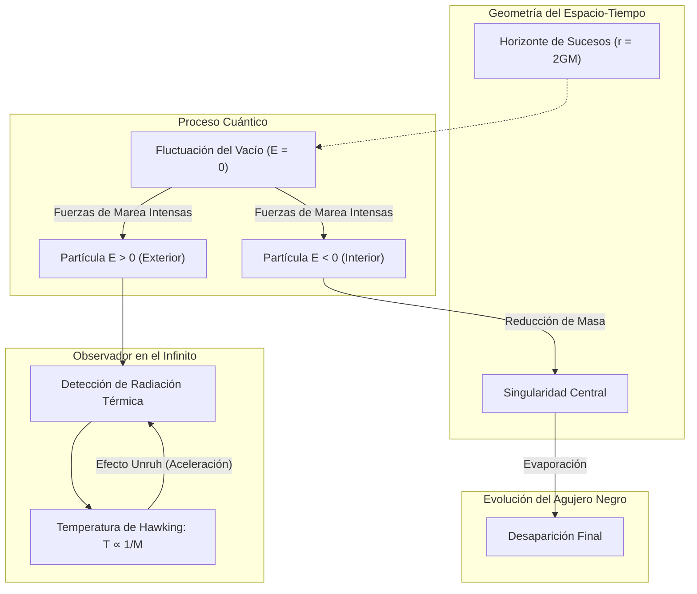

# Diagrama de la Radiación de Hawking

Este diagrama ilustra el proceso de creación de pares cerca del horizonte de sucesos de un agujero negro, que da lugar a la radiación de Hawking.

## Explicación Conceptual Detallada

1. **Fluctuación del Vacío y Separación**: En las cercanías del horizonte, las fluctuaciones del vacío crean pares de partículas. Debido a la curvatura extrema, una partícula con **energía negativa** (respecto a un observador lejano) cae al interior, mientras que su compañera con **energía positiva** escapa.
2. **Conservación de la Energía**: La partícula que escapa quita energía al agujero negro. Como $E=mc^2$, el agujero negro pierde masa.
3. **Espectro Térmico y Temperatura**: La radiación emitida no es aleatoria, sigue un espectro de cuerpo negro perfecto. La temperatura es:
   $$T_H = \frac{\hbar c^3}{8\pi G M k_B}$$
4. **Relación con el Efecto Unruh**: Un observador acelerado en el espacio plano percibe el vacío como un baño térmico. Por el **Principio de Equivalencia**, un observador en reposo cerca de un agujero negro (acelerado para no caer) detecta una temperatura similar, que se convierte en radiación de Hawking al propagarse al infinito.
5. **Evaporación**: A medida que $M$ disminuye, $T_H$ aumenta. El proceso se acelera drásticamente al final de la vida del agujero negro.
