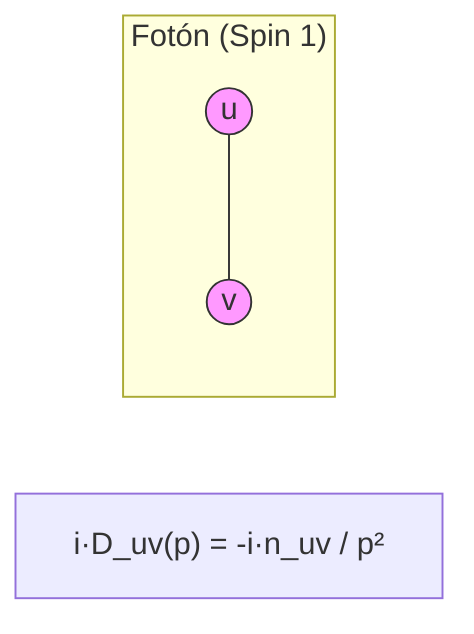
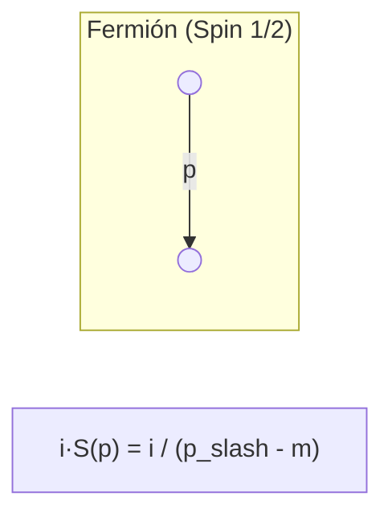
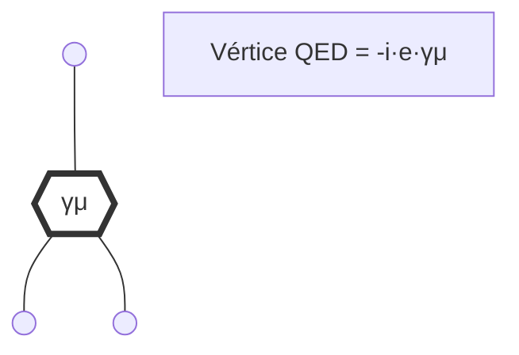

# Reglas de Feynman para QED

Este documento recopila los elementos visuales y algebraicos necesarios para construir amplitudes de dispersión en Electrodinámica Cuántica (QED).

## 1. Propagadores

## 2. Vértice de Interacción

## 3. Líneas Externas

| Partícula | Entrada | Salida |
| :--- | :--- | :--- |
| **Electrón** | $u(p,s)$ | $\bar{u}(p,s)$ |
| **Positrón** | $\bar{v}(p,s)$ | $v(p,s)$ |
| **Fotón** | $\epsilon_\mu(p,\lambda)$ | $\epsilon_\mu^*(p,\lambda)$ |

## 4. Resumen de Signos

1. **Bucles de Fermiones**: Cada bucle cerrado de fermiones introduce un factor de $(-1)$.
2. **Estadística**: El intercambio de dos fermiones externos introduce un factor de $(-1)$.
3. **Momentos**: La conservación del momento se aplica en cada vértice: $\sum k_{\text{in}} = \sum k_{\text{out}}$.

---
[Volver al Índice del Tutorial](../README.md)
