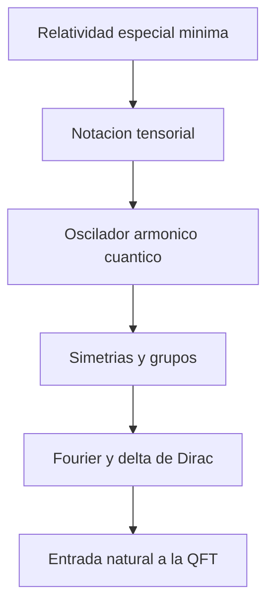

# Modulo 00: Prerrequisitos

## Objetivo

Este bloque reune el material minimo necesario para que el resto del tutorial no tenga que reexplicar cada herramienta matematica o fisica desde cero.

## Ruta recomendada

1. `01_relatividad_especial_minima.md`
2. `02_notacion_tensorial_y_convenciones.md`
3. `03_oscilador_armonico_cuantico.md`
4. `04_simetrias_y_grupos_basicos.md`
5. `05_delta_de_dirac_y_transformadas_de_fourier.md`

## Mapa del bloque

## Contenido disponible

### 1. Relatividad especial minima

Repaso de espacio-tiempo de Minkowski, cuatro-vectores, relacion energia-momento y estructura causal.

### 2. Notacion tensorial y convenciones

Indices covariantes y contravariantes, metrica, suma de Einstein, derivadas e integrales relativistas.

### 3. Oscilador armonico cuantico

El ejemplo cuantico mas importante para entender por que un campo libre se comporta como una coleccion de osciladores.

### 4. Simetrias y grupos basicos

Simetrias continuas, grupos, generadores y el papel estructural de las representaciones.

### 5. Delta de Dirac y transformadas de Fourier

Herramientas tecnicas esenciales para pasar entre espacio de posiciones y espacio de momentos.

## Funcion dentro del curso

No es un modulo avanzado, pero si estrategico. Su papel es reducir friccion y permitir que los modulos centrales se concentren en QFT sin convertirse en un curso paralelo de prerequisitos.

## Resultado esperado

Al terminar este bloque, el lector deberia poder:

- manipular cuatro-vectores y reconocer intervalos relativistas;
- leer expresiones tensoriales basicas sin perderse en la notacion;
- entender por que el oscilador armonico es el alfabeto de la cuantizacion de campos;
- reconocer la relacion entre simetria y estructura teorica;
- usar la delta de Dirac y las transformadas de Fourier en contextos simples.
