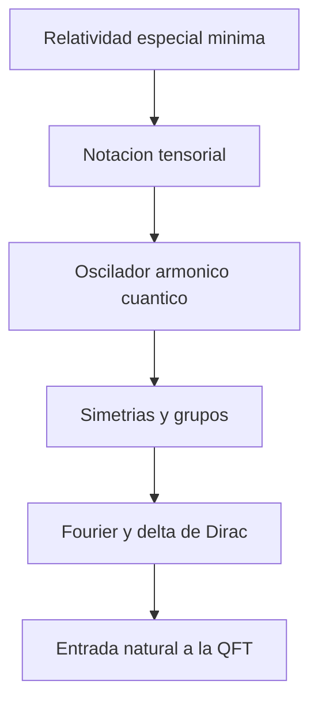

# Modulo 00: Prerrequisitos

## Objetivo

Este bloque reune el material minimo necesario para que el resto del tutorial no tenga que reexplicar cada herramienta matematica o fisica desde cero.

## Prerequisitos

Este es el punto de entrada del tutorial. Basta con un dominio razonable de mecanica cuantica basica, calculo multivariable y algebra lineal.

## Ruta recomendada

1. `01_relatividad_especial_minima.md`
2. `02_notacion_tensorial_y_convenciones.md`
3. `03_oscilador_armonico_cuantico.md`
4. `04_simetrias_y_grupos_basicos.md`
5. `05_delta_de_dirac_y_transformadas_de_fourier.md`

## Capitulos imprescindibles en primera pasada

Si quieres una primera vuelta compacta del modulo, prioriza:

- [01 Relatividad especial minima](01_relatividad_especial_minima.md): fija el lenguaje relativista minimo.
- [03 Oscilador armonico cuantico](03_oscilador_armonico_cuantico.md): prepara el salto a modos y cuantizacion de campos.
- [05 Delta de Dirac y transformadas de Fourier](05_delta_de_dirac_y_transformadas_de_fourier.md): reduce mucha friccion tecnica en los modulos centrales.

## Cuadernos asociados

- `../../Cuadernos/problemas_resueltos/01_relatividad_especial_basica.ipynb`
- `../../Cuadernos/problemas_resueltos/02_notacion_tensorial_y_convenciones.ipynb`
- `../../Cuadernos/problemas_resueltos/03_oscilador_armonico_cuantico.ipynb`
- `../../Cuadernos/problemas_resueltos/04_simetrias_y_grupos_basicos.ipynb`
- `../../Cuadernos/problemas_resueltos/05_delta_de_dirac_y_fourier.ipynb`

Uso sugerido:

- usar cada cuaderno como apoyo inmediato del articulo correspondiente;
- priorizar `03_oscilador_armonico_cuantico.ipynb` si se quiere preparar mejor el salto a cuantizacion de campos;
- usar `05_delta_de_dirac_y_fourier.ipynb` como referencia de consulta cuando empiece el trabajo en espacio de momentos.

## Mapa del bloque

## Contenido disponible

### 1. Relatividad especial minima

Repaso de espacio-tiempo de Minkowski, cuatro-vectores, relacion energia-momento y estructura causal.

### 2. Notacion tensorial y convenciones

Indices covariantes y contravariantes, metrica, suma de Einstein, derivadas e integrales relativistas.

### 3. Oscilador armonico cuantico

El ejemplo cuantico mas importante para entender por que un campo libre se comporta como una coleccion de osciladores.

### 4. Simetrias y grupos basicos

Simetrias continuas, grupos, generadores y el papel estructural de las representaciones.

### 5. Delta de Dirac y transformadas de Fourier

Herramientas tecnicas esenciales para pasar entre espacio de posiciones y espacio de momentos.

## Funcion dentro del curso

No es un modulo avanzado, pero si estrategico. Su papel es reducir friccion y permitir que los modulos centrales se concentren en QFT sin convertirse en un curso paralelo de prerequisitos.

## Resultado esperado

Al terminar este bloque, el lector deberia poder:

- manipular cuatro-vectores y reconocer intervalos relativistas;
- leer expresiones tensoriales basicas sin perderse en la notacion;
- entender por que el oscilador armonico es el alfabeto de la cuantizacion de campos;
- reconocer la relacion entre simetria y estructura teorica;
- usar la delta de Dirac y las transformadas de Fourier en contextos simples.

## Sintesis del modulo

Este modulo fija el alfabeto minimo del tutorial: relatividad, notacion, osciladores, simetrias y Fourier. Si aqui queda todo claro, el salto a campos y cuantizacion resulta mucho mas natural.

!!! note "Idea clave"
    Este bloque no es relleno previo al curso: contiene herramientas que reaparecen en casi todos los modulos tecnicos.

!!! warning "Error frecuente"
    Intentar empezar por diagramas o gauge sin dominar Fourier, osciladores y relatividad suele volver el tutorial innecesariamente opaco.

!!! tip "Conexion con el siguiente modulo"
    El paso natural despues de este bloque es preguntarse por que la QFT necesita campos y no solo particulas: esa es exactamente la funcion del modulo 01.

## Ejercicios sugeridos

1. Comprueba la relacion relativista $E^2=\mathbf{p}^2+m^2$ en distintos limites y comenta su lectura fisica.
2. Reescribe una expresion sencilla con indices covariantes y contravariantes usando la metrica.
3. Explica por que el oscilador armonico es el modelo elemental para entender modos de un campo libre.
4. Da un ejemplo de simetria continua y señala su generador asociado.
5. Usa una transformada de Fourier simple para mostrar por que la delta de Dirac actua como identidad distribucional.

## Lecturas y referencias recomendadas

- Introductorio: David Tong, notas de relatividad y QFT para afianzar lenguaje y convenciones.
- Intermedio: Zee, *Quantum Field Theory in a Nutshell*, para intuicion sobre simetria, osciladores y campos.
- Consulta matematica: cualquier texto breve de relatividad especial y transformadas de Fourier que el lector ya maneje con soltura.

## Navegacion

Siguiente: [01 Fundamentos Conceptuales](../01_fundamentos_conceptuales/README.md)
