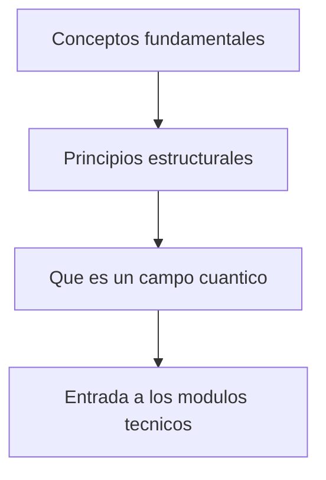

# Modulo 01: Fundamentos Conceptuales

## Objetivo

Este modulo fija la ontologia y los principios del tutorial antes de entrar en tecnicas. La idea es responder con claridad:

- que problema resuelve la QFT;
- por que los campos son fundamentales;
- que principios estructurales restringen toda teoria cuantica de campos consistente.

## Prerequisitos

- Haber repasado el bloque [00 Prerrequisitos](../00_prerrequisitos/README.md).
- Llegar con comodidad minima en relatividad especial, oscilador armonico y notacion tensorial.

## Documentos del modulo

1. `01_conceptos_fundamentales.md`
2. `02_principios_estructurales_de_la_qft.md`
3. `03_que_es_un_campo_cuantico.md`

## Mapa del modulo

## Cuadernos asociados

- `../../Cuadernos/ejemplos/02_principios_estructurales_y_restricciones.ipynb`
- `../../Cuadernos/problemas_resueltos/06_fundamentos_conceptuales.ipynb`

Uso sugerido:

- el cuaderno de `ejemplos` sirve para fijar el vocabulario estructural minimo antes de entrar en tecnicas;
- el de `problemas_resueltos` sirve para revisar las preguntas mas conceptuales del bloque y consolidar la idea de campo cuantico.

## Resultado esperado

Al terminar este bloque, deberia ser posible leer los modulos tecnicos sabiendo ya por que aparecen accion, simetria, cuantizacion, vacio, localidad, antiparticulas y renormalizacion.

## Sintesis del modulo

Este modulo responde la pregunta "que es realmente la QFT" antes de entrar en tecnicas. Su funcion es dejar claro el problema fisico, el cambio de ontologia y los principios de consistencia.

!!! note "Idea clave"
    Aqui se fija el cambio de paradigma del curso: las particulas pasan a entenderse como excitaciones de campos cuanticos.

!!! warning "Error frecuente"
    Leer este modulo como filosofia separada del resto es un error; en realidad prepara el sentido de casi todas las tecnicas posteriores.

!!! tip "Conexion con el siguiente modulo"
    Una vez entendido por que los campos son necesarios, el siguiente paso es ver por que relatividad y localidad obligan a formularlos de manera concreta.

## Ejercicios sugeridos

1. Explica por que la QFT no debe verse solo como una mecanica cuantica relativista de una particula.
2. Enumera tres principios estructurales que restringen una QFT consistente y comenta por que importan.
3. Compara la nocion de particula fundamental con la de campo cuantico como objeto organizador.
4. Explica por que vacio, antiparticulas y numero variable de excitaciones pertenecen al mismo cambio conceptual.

## Lecturas y referencias recomendadas

- Introductorio: Zee, *Quantum Field Theory in a Nutshell*, caps. iniciales.
- Intermedio: Tong, *Lectures on Quantum Field Theory*, introduccion y motivacion fisica.
- Consulta: Peskin y Schroeder, secciones introductorias para fijar el problema fisico que resuelve la QFT.

## Navegacion

Anterior: [00 Prerrequisitos](../00_prerrequisitos/README.md)

Siguiente: [02 Relatividad y Campos](../02_relatividad_y_campos/README.md)
