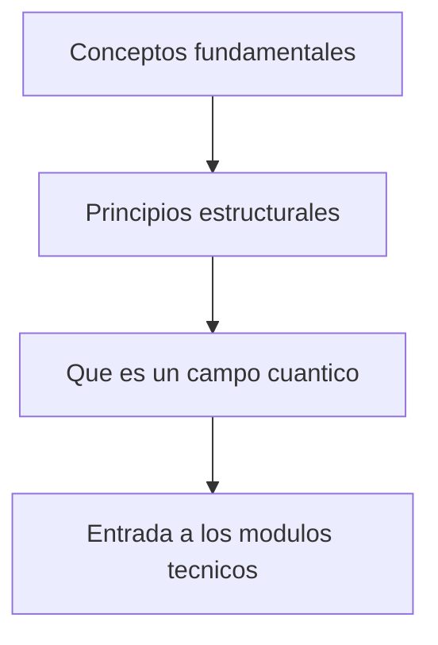

# Modulo 01: Fundamentos Conceptuales

## Objetivo

Este modulo fija la ontologia y los principios del tutorial antes de entrar en tecnicas. La idea es responder con claridad:

- que problema resuelve la QFT;
- por que los campos son fundamentales;
- que principios estructurales restringen toda teoria cuantica de campos consistente.

## Documentos del modulo

1. `01_conceptos_fundamentales.md`
2. `02_principios_estructurales_de_la_qft.md`
3. `03_que_es_un_campo_cuantico.md`

## Mapa del modulo

## Cuadernos asociados

- `../../Cuadernos/ejemplos/02_principios_estructurales_y_restricciones.ipynb`
- `../../Cuadernos/problemas_resueltos/06_fundamentos_conceptuales.ipynb`

## Resultado esperado

Al terminar este bloque, deberia ser posible leer los modulos tecnicos sabiendo ya por que aparecen accion, simetria, cuantizacion, vacio, localidad, antiparticulas y renormalizacion.
