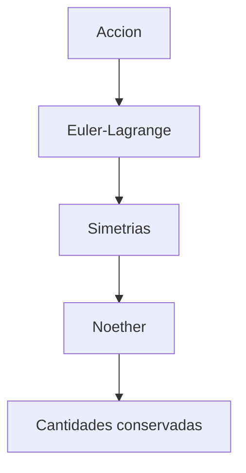

# Modulo 03: Accion, Lagrangiana y Simetrias

## Objetivo

Este modulo introduce el lenguaje estructural de la teoria de campos: accion, densidad lagrangiana, ecuaciones de Euler-Lagrange y teorema de Noether.

## Prerequisitos

- [02 Relatividad y Campos](../02_relatividad_y_campos/README.md).
- Manejo basico de derivadas variacionales, indices y principios de simetria.

## Por que este modulo importa

En QFT, una enorme cantidad de informacion fisica se concentra en una sola expresion, la densidad lagrangiana. Desde ella se leen:

- la cinematica del sistema;
- los terminos de masa;
- las interacciones;
- las simetrias;
- las corrientes conservadas.

## Documentos del modulo

1. `01_principio_de_accion_y_ecuaciones_de_campo.md`
2. `02_teorema_de_noether_y_simetria.md`

## Mapa del modulo

## Cuadernos asociados

- `../../Cuadernos/ejemplos/04_accion_y_euler_lagrange.ipynb`
- `../../Cuadernos/problemas_resueltos/08_accion_y_noether.ipynb`

Uso sugerido:

- el cuaderno de `ejemplos` sirve para fijar la mecanica del principio variacional y las ecuaciones de Euler-Lagrange;
- el de `problemas_resueltos` sirve para practicar el paso desde una simetria continua hasta una corriente conservada.

## Resultado esperado

Al terminar este bloque, deberia ser posible mirar una lagrangiana simple y explicar:

- que ecuaciones de movimiento genera;
- que simetrias exhibe;
- que cantidades conservadas deben aparecer.

## Ejercicios sugeridos

1. Deriva las ecuaciones de Euler-Lagrange de una lagrangiana escalar simple.
2. Explica por que una densidad lagrangiana concentra cinematica, masas e interacciones.
3. Da un ejemplo de simetria continua y describe la corriente conservada asociada.
4. Explica por que este modulo es el puente natural entre motivacion conceptual y cuantizacion.

## Lecturas y referencias recomendadas

- Introductorio: Srednicki, secciones iniciales sobre accion y lagrangianos.
- Intermedio: Tong, notas sobre principio de accion y Noether.
- Consulta: Peskin y Schroeder, formulacion lagrangiana y corrientes conservadas.

## Navegacion

Anterior: [02 Relatividad y Campos](../02_relatividad_y_campos/README.md)

Siguiente: [04 Cuantizacion del Campo Escalar](../04_cuantizacion_del_campo_escalar/README.md)
