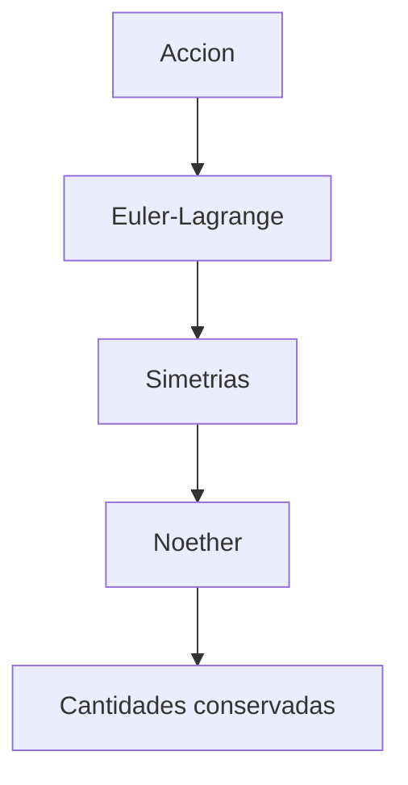

# Modulo 03: Accion, Lagrangiana y Simetrias

## Objetivo

Este modulo introduce el lenguaje estructural de la teoria de campos: accion, densidad lagrangiana, ecuaciones de Euler-Lagrange y teorema de Noether.

## Por que este modulo importa

En QFT, una enorme cantidad de informacion fisica se concentra en una sola expresion, la densidad lagrangiana. Desde ella se leen:

- la cinematica del sistema;
- los terminos de masa;
- las interacciones;
- las simetrias;
- las corrientes conservadas.

## Documentos del modulo

1. `01_principio_de_accion_y_ecuaciones_de_campo.md`
2. `02_teorema_de_noether_y_simetria.md`

## Mapa del modulo

## Cuadernos asociados

- `../../Cuadernos/ejemplos/04_accion_y_euler_lagrange.ipynb`
- `../../Cuadernos/problemas_resueltos/08_accion_y_noether.ipynb`

## Resultado esperado

Al terminar este bloque, deberia ser posible mirar una lagrangiana simple y explicar:

- que ecuaciones de movimiento genera;
- que simetrias exhibe;
- que cantidades conservadas deben aparecer.
