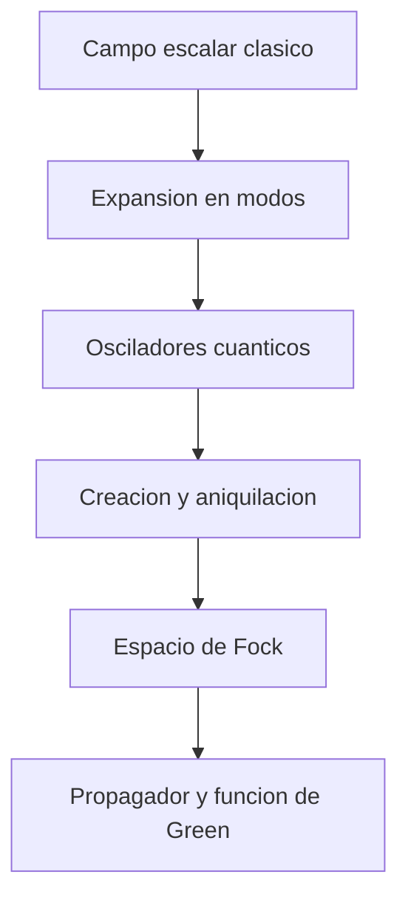

# Modulo 04: Cuantizacion del Campo Escalar

## Objetivo

Este modulo da el salto desde el campo clasico hasta el campo cuantizado usando el ejemplo mas simple posible: un campo escalar libre.

## Prerequisitos

- [03 Accion y Simetrias](../03_accion_y_simetrias/README.md).
- Familiaridad con el oscilador armonico cuantico del bloque [00 Prerrequisitos](../00_prerrequisitos/README.md).

## Documentos del modulo

1. `01_campo_escalar_clasico_y_modos_normales.md`
2. `02_cuantizacion_canonica_y_espacio_de_fock.md`
3. `03_propagador_causalidad_y_funcion_de_green.md`

## Mapa del modulo

## Apoyo recomendado

Este modulo se entiende mucho mejor si antes se ha leido:

- `../01_fundamentos_conceptuales/03_que_es_un_campo_cuantico.md`

## Cuadernos asociados

- `../../Cuadernos/ejemplos/05_cuantizacion_del_campo_escalar.ipynb`
- `../../Cuadernos/problemas_resueltos/09_cuantizacion_del_campo_escalar.ipynb`

## Hilo conceptual

La idea principal es mostrar que la cuantizacion del campo no es un acto misterioso. Se apoya en una observacion muy concreta:

- el campo libre puede descomponerse en modos;
- cada modo se comporta como un oscilador armonico;
- al cuantizar esos osciladores aparecen cuantos de excitacion;
- esos cuantos se interpretan como particulas;
- los correladores del vacio y el propagador libre conectan este modulo con la teoria perturbativa.

## Resultado esperado

Al final del modulo, el lector deberia entender la arquitectura basica del espacio de Fock, la relacion entre operadores de campo y estados multiparticle, y por que el propagador libre reaparece despues como bloque elemental de diagramas y amplitudes.

## Sintesis del modulo

Este modulo contiene el primer gran cambio conceptual del tutorial: un campo libre cuantizado se convierte en una familia de osciladores cuyas excitaciones son las particulas.

!!! note "Idea clave"
    El espacio de Fock no es un añadido artificial: aparece de forma natural al cuantizar los modos del campo libre.

!!! warning "Error frecuente"
    Confundir el campo cuantico con una simple onda clasica extendida o con una funcion de onda de una particula.

!!! tip "Conexion con el siguiente modulo"
    Cuando ya existen propagadores y excitaciones del campo, el siguiente paso es introducir interacciones y amplitudes de scattering.

## Ejercicios sugeridos

1. Deriva la ecuacion de Klein-Gordon a partir de la lagrangiana del campo escalar libre y verifica su relacion de dispersion.
2. Explica por que la expansion en modos del campo libre puede leerse como una coleccion continua de osciladores armonicos.
3. Deduce las relaciones de conmutacion de los operadores $a(\mathbf p)$ y $a^\dagger(\mathbf p)$ a partir de las relaciones canonicas a tiempo igual.
4. Interpreta fisicamente el estado de vacio y compáralo con la idea clasica de "ausencia de campo".
5. Muestra por que el propagador libre actua como funcion de Green del operador de Klein-Gordon y explica el papel de la prescripcion $i\epsilon$.

## Lecturas y referencias recomendadas

- Introductorio: Srednicki, campo escalar libre.
- Intermedio: Peskin y Schroeder, cuantizacion canonica del campo escalar.
- Complementario: Tong, tratamiento pedagogico de modos y operadores.
- Complementario: introducciones a funciones de Green y propagador de Feynman para el caso escalar.

## Navegacion

Anterior: [03 Accion y Simetrias](../03_accion_y_simetrias/README.md)

Siguiente: [05 Interacciones y Perturbaciones](../05_interacciones_y_perturbaciones/README.md)
