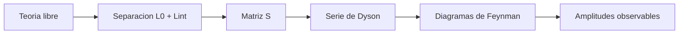

# Modulo 05: Interacciones y Perturbaciones

## Objetivo

Este modulo introduce el paso desde teorias libres a teorias interactuantes y presenta el marco perturbativo que conduce a la matriz $S$ y a los diagramas de Feynman.

## Documentos del modulo

1. `01_teoria_de_perturbaciones_y_matriz_s.md`
2. `02_diagramas_de_feynman_y_reglas.md`

## Mapa del modulo

## Hilo conceptual

Las ideas clave del modulo son:

- una teoria libre no basta para describir procesos fisicos observables;
- las interacciones se codifican localmente en la lagrangiana;
- muchas amplitudes se estudian como expansion en potencias del acoplamiento;
- los diagramas de Feynman son una sintaxis de esa expansion.

## Cuadernos asociados

- `../../Cuadernos/ejemplos/06_diagramas_de_feynman_basicos.ipynb`
- `../../Cuadernos/problemas_resueltos/10_interacciones_y_perturbaciones.ipynb`

## Resultado esperado

Al terminar, el lector deberia saber que objeto se calcula en un problema de dispersion y por que un diagrama no es una fotografia del proceso, sino un termino organizado de una serie perturbativa.
