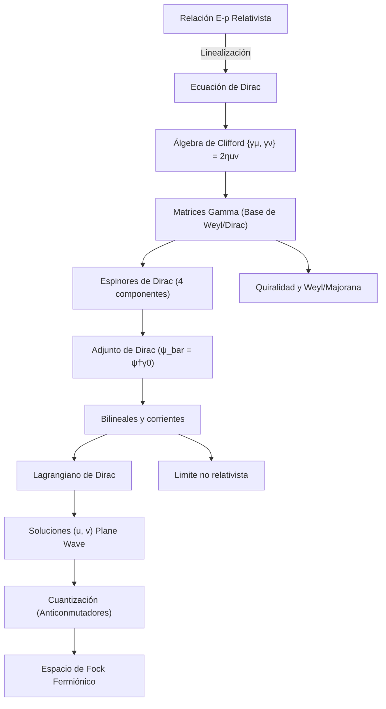

# Modulo 06: Fermiones y Ecuacion de Dirac

## Objetivo

Este modulo desarrolla la descripcion relativista de fermiones, espinores y ecuacion de Dirac, y muestra como la cuantizacion de campos fermionicos completa el cuadro iniciado con el campo escalar.

## Prerequisitos

- [02 Relatividad y Campos](../02_relatividad_y_campos/README.md).
- [04 Cuantizacion del Campo Escalar](../04_cuantizacion_del_campo_escalar/README.md).
- Manejo comodo de lagrangianos relativistas y espacio de Fock.

## Documentos del modulo

1. `01_motivacion_y_ecuacion_de_dirac.md`
2. `02_cuantizacion_de_campos_fermionicos.md`
3. `03_algebra_gamma_y_bilineales_de_dirac.md`
4. `04_corriente_de_dirac_y_limite_no_relativista.md`
5. `05_quiralidad_weyl_y_majorana.md`

## Cuadernos asociados

- `../../Cuadernos/problemas_resueltos/06_fundamentos_conceptuales.ipynb`
- `../../Cuadernos/problemas_resueltos/07_relatividad_y_campos.ipynb`
- `../../Cuadernos/problemas_resueltos/09_cuantizacion_del_campo_escalar.ipynb`
- `../../Cuadernos/ejemplos/09_bilineales_y_proyectores_quirales.ipynb`
- `../../Cuadernos/problemas_resueltos/18_corriente_de_dirac_y_limite_no_relativista.ipynb`

Uso sugerido:

- el cuaderno de `06_fundamentos_conceptuales` sirve para reforzar la idea de campo y simetria antes del paso fermionico;
- el de `07_relatividad_y_campos` sirve como apoyo del trasfondo relativista que hace necesaria la ecuacion de Dirac;
- el de `09_cuantizacion_del_campo_escalar` sirve como contraste con el caso bosonico al estudiar cuantizacion y espacio de Fock.
- el de `09_bilineales_y_proyectores_quirales` sirve para fijar bilineales, corrientes vectoriales y axiales, y proyectores quirales;
- el de `18_corriente_de_dirac_y_limite_no_relativista` sirve para seguir de forma guiada la corriente conservada y el paso controlado al regimen no relativista.

## Conceptos Clave Añadidos

### El Lagrangiano de Dirac
A diferencia del campo escalar, el lagrangiano de Dirac debe ser lineal en derivadas para ser consistente con la ecuación de movimiento de primer orden:
$$\mathcal{L} = \bar{\psi}(i\gamma^\mu \partial_\mu - m)\psi$$
Aquí, $\bar{\psi} = \psi^\dagger \gamma^0$ es indispensable para garantizar la invariancia de Lorentz.

### Espinores de Dirac
Los espinores de 4 componentes no son vectores de Lorentz; transforman bajo la representación $(1/2, 0) \oplus (0, 1/2)$. Esto permite describir tanto partículas con helicidad izquierda como derecha, y es la base para entender la quiralidad en el Modelo Estándar.

## Resultado esperado

Al terminar este modulo, deberia quedar claro:

- por que la ecuacion de Dirac fue necesaria historica y conceptualmente;
- que son los espinores y la algebra gamma;
- como aparecen antiparticulas en el formalismo fermionico;
- por que los campos fermionicos se cuantizan con anticonmutadores;
- como se organizan los bilineales de Dirac;
- por que la corriente conservada y el limite no relativista son pruebas importantes de consistencia fisica.

## Sintesis del modulo

Este modulo completa la base relativista del curso con fermiones, espinores y anticonmutacion. Aqui aparecen varias de las piezas que luego hacen posible QED y el sector quiral del Modelo Estandar.

!!! note "Idea clave"
    El formalismo de Dirac no solo describe fermiones relativistas: tambien explica por que el espin y las antiparticulas aparecen de forma estructural.

!!! warning "Error frecuente"
    Pensar que quiralidad, Dirac, Weyl y Majorana son solo cambios de notacion sin contenido fisico propio.

!!! tip "Conexion con el siguiente modulo"
    La corriente de Dirac y la estructura fermionica relativista preparan directamente la entrada a simetria gauge local y QED.

## Ejercicios sugeridos

1. Explica por que la ecuacion de Klein-Gordon no era suficiente como teoria relativista satisfactoria para fermiones de espin $1/2$.
2. Deriva la corriente conservada asociada al lagrangiano de Dirac y comenta su interpretacion fisica.
3. Compara conmutadores bosonicos y anticonmutadores fermionicos y explica por que el espacio de Fock fermionico implementa el principio de exclusion.
4. Clasifica los bilineales $\bar{\psi}\psi$, $\bar{\psi}\gamma^\mu\psi$ y $\bar{\psi}\gamma^\mu\gamma^5\psi$ y comenta que tipo de objetos fisicos representan.
5. Explica el papel de los proyectores quirales y resume la diferencia entre espinores de Dirac, Weyl y Majorana.

## Ampliaciones prioritarias

- conectar con simetrias discretas $C$, $P$ y $T$;
- ampliar un tratamiento futuro de neutrinos y masas de Majorana;
- profundizar proyectores quirales y corrientes axiales.

## Lecturas y referencias recomendadas

- Introductorio: Tong, secciones sobre fermiones relativistas.
- Intermedio: Srednicki, tratamiento de espinores y cuantizacion fermionica.
- Consulta: Peskin y Schroeder, capitulo de Dirac y espinores.

## Navegacion

Anterior: [05 Interacciones y Perturbaciones](../05_interacciones_y_perturbaciones/README.md)

Siguiente: [07 Gauge y QED](../07_gauge_y_qed/README.md)
