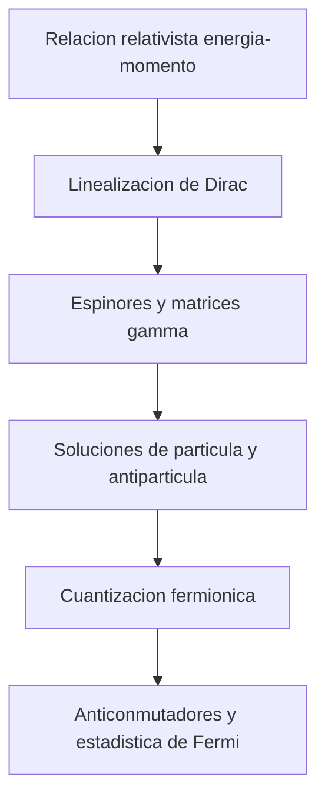

# Modulo 06: Fermiones y Ecuacion de Dirac

## Objetivo

Este modulo desarrolla la descripcion relativista de fermiones, espinores y ecuacion de Dirac, y muestra como la cuantizacion de campos fermionicos completa el cuadro iniciado con el campo escalar.

## Documentos del modulo

1. `01_motivacion_y_ecuacion_de_dirac.md`
2. `02_cuantizacion_de_campos_fermionicos.md`

## Mapa del modulo

## Resultado esperado

Al terminar este modulo, deberia quedar claro:

- por que la ecuacion de Dirac fue necesaria historica y conceptualmente;
- que son los espinores y la algebra gamma;
- como aparecen antiparticulas en el formalismo fermionico;
- por que los campos fermionicos se cuantizan con anticonmutadores.
