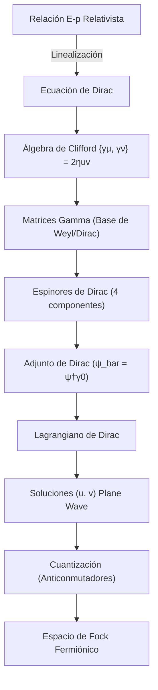

# Modulo 06: Fermiones y Ecuacion de Dirac

## Objetivo

Este modulo desarrolla la descripcion relativista de fermiones, espinores y ecuacion de Dirac, y muestra como la cuantizacion de campos fermionicos completa el cuadro iniciado con el campo escalar.

## Documentos del modulo

1. `01_motivacion_y_ecuacion_de_dirac.md`
2. `02_cuantizacion_de_campos_fermionicos.md`
3. `03_weyl_majorana_y_teoria_de_grupos.md`

## Conceptos Clave Añadidos

### El Lagrangiano de Dirac
A diferencia del campo escalar, el lagrangiano de Dirac debe ser lineal en derivadas para ser consistente con la ecuación de movimiento de primer orden:
$$\mathcal{L} = \bar{\psi}(i\gamma^\mu \partial_\mu - m)\psi$$
Aquí, $\bar{\psi} = \psi^\dagger \gamma^0$ es indispensable para garantizar la invariancia de Lorentz.

### Espinores de Dirac
Los espinores de 4 componentes no son vectores de Lorentz; transforman bajo la representación $(1/2, 0) \oplus (0, 1/2)$. Esto permite describir tanto partículas con helicidad izquierda como derecha, y es la base para entender la quiralidad en el Modelo Estándar.

## Resultado esperado

Al terminar este modulo, deberia quedar claro:

- por que la ecuacion de Dirac fue necesaria historica y conceptualmente;
- que son los espinores y la algebra gamma;
- como aparecen antiparticulas en el formalismo fermionico;
- por que los campos fermionicos se cuantizan con anticonmutadores.
