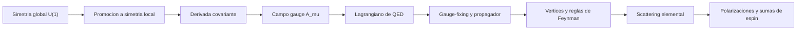

# Modulo 07: Gauge y QED

## Objetivo

Este modulo desarrolla la simetria gauge local, la electrodinamica cuantica y la interpretacion de la interaccion electromagnetica como acoplamiento entre campos.

## Prerequisitos

- [06 Fermiones y Dirac](../06_fermiones_y_dirac/README.md).
- [05 Interacciones y Perturbaciones](../05_interacciones_y_perturbaciones/README.md).
- Comodidad con corrientes conservadas y formulacion lagrangiana.

## Documentos del modulo

1. `01_simetria_gauge_local_y_derivada_covariante.md`
2. `02_qed_y_lagrangiano_fundamental.md`
3. `03_fijacion_de_gauge_y_propagador_del_foton.md`
4. `04_scattering_basico_en_qed.md`
5. `05_polarizaciones_y_sumas_de_espin.md`

## Capitulos imprescindibles en primera pasada

- [01 Simetria gauge local y derivada covariante](01_simetria_gauge_local_y_derivada_covariante.md): contiene la idea estructural del modulo.
- [02 QED y lagrangiano fundamental](02_qed_y_lagrangiano_fundamental.md): ensambla el primer ejemplo gauge completo.
- [03 Fijacion de gauge y propagador del foton](03_fijacion_de_gauge_y_propagador_del_foton.md): aclara el paso tecnico indispensable para calcular.

## Mapa del modulo

## Cuadernos asociados

- `../../Cuadernos/ejemplos/06_diagramas_de_feynman_basicos.ipynb`
- `../../Cuadernos/ejemplos/16_qed_derivada_covariante_y_ward.ipynb`
- `../../Cuadernos/problemas_resueltos/10_interacciones_y_perturbaciones.ipynb`
- `../../Cuadernos/problemas_resueltos/13_gauge_fixing_y_scattering_en_qed.ipynb`

Uso sugerido:

- el cuaderno de `ejemplos` sirve para repasar propagadores, vertices y lectura de diagramas;
- el de `16_qed_derivada_covariante_y_ward` sirve para fijar la estructura gauge minima y la intuicion de la identidad de Ward;
- el cuaderno de `problemas_resueltos` sirve como apoyo general para la logica perturbativa que luego se especializa en QED;
- el de `13_gauge_fixing_y_scattering_en_qed` sirve para seguir un caso mas directo de gauge-fixing, propagador del foton y amplitud elemental.

## Resultado esperado

Al terminar este modulo, deberia quedar claro:

- por que una simetria local obliga a introducir un campo gauge;
- como aparece la derivada covariante;
- cual es la estructura del lagrangiano de QED;
- por que QED es el ejemplo pedagogico central de teoria gauge cuantica;
- por que la fijacion de gauge y el propagador del foton son pasos tecnicos inevitables;
- como se organiza una amplitud elemental de scattering en QED.

## Sintesis del modulo

Este modulo ensena como una simetria local genera una teoria gauge y usa QED como primer ejemplo completo donde se unen corriente, campo gauge, Ward y scattering real.

!!! note "Idea clave"
    Una simetria local no solo restringe la teoria: obliga a introducir nueva estructura dinamica.

!!! warning "Error frecuente"
    Confundir fijacion de gauge con ruptura fisica de la simetria gauge.

!!! tip "Conexion con el siguiente modulo"
    El siguiente bloque muestra un lenguaje alternativo y muy potente para volver a pensar correladores, amplitudes y vacio: la integral de camino.

## Ejercicios sugeridos

1. Muestra por que promover una simetria global $U(1)$ a una simetria local obliga a introducir una derivada covariante.
2. Escribe el lagrangiano minimo de QED e identifica que termino produce el vertice fermion-foton.
3. Explica por que el propagador del foton no puede discutirse limpiamente sin fijacion de gauge.
4. Describe la estructura de una amplitud elemental en QED, distinguiendo lineas externas, propagadores internos y factor de vertice.
5. Compara la corriente de Dirac con la corriente electromagnetica que aparece en QED y explica por que la identidad de Ward es conceptualmente importante.

## Profundizaciones sugeridas

- recorrer un calculo completo de scattering $e^- \mu^- \to e^- \mu^-$ o $e^+e^- \to \mu^+\mu^-$;
- enlazar este modulo con renormalizacion en QED a un lazo dentro del modulo `09`;
- usarlo como base antes de entrar en correcciones radiativas y running electromagnetico.

## Lecturas y referencias recomendadas

- Introductorio: Tong, notas sobre simetria gauge y QED.
- Intermedio: Peskin y Schroeder, capitulos introductorios de QED.
- Complementario: Zee, para reforzar la intuicion de por que la simetria local organiza la interaccion.

## Navegacion

Anterior: [06 Fermiones y Dirac](../06_fermiones_y_dirac/README.md)

Siguiente: [08 Integral de Camino](../08_integral_de_camino/README.md)
