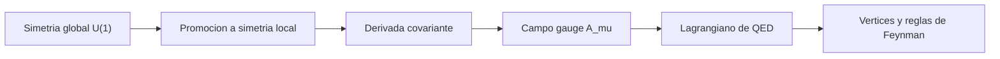

# Modulo 07: Gauge y QED

## Objetivo

Este modulo desarrolla la simetria gauge local, la electrodinamica cuantica y la interpretacion de la interaccion electromagnetica como acoplamiento entre campos.

## Documentos del modulo

1. `01_simetria_gauge_local_y_derivada_covariante.md`
2. `02_qed_y_lagrangiano_fundamental.md`

## Mapa del modulo

## Resultado esperado

Al terminar este modulo, deberia quedar claro:

- por que una simetria local obliga a introducir un campo gauge;
- como aparece la derivada covariante;
- cual es la estructura del lagrangiano de QED;
- por que QED es el ejemplo pedagogico central de teoria gauge cuantica.
