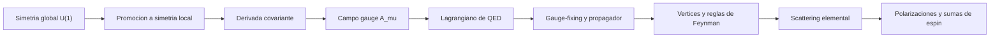

# Modulo 07: Gauge y QED

## Objetivo

Este modulo desarrolla la simetria gauge local, la electrodinamica cuantica y la interpretacion de la interaccion electromagnetica como acoplamiento entre campos.

## Prerequisitos

- [06 Fermiones y Dirac](../06_fermiones_y_dirac/README.md).
- [05 Interacciones y Perturbaciones](../05_interacciones_y_perturbaciones/README.md).
- Comodidad con corrientes conservadas y formulacion lagrangiana.

## Documentos del modulo

1. `01_simetria_gauge_local_y_derivada_covariante.md`
2. `02_qed_y_lagrangiano_fundamental.md`
3. `03_fijacion_de_gauge_y_propagador_del_foton.md`
4. `04_scattering_basico_en_qed.md`
5. `05_polarizaciones_y_sumas_de_espin.md`

## Mapa del modulo

## Cuadernos asociados

- `../../Cuadernos/ejemplos/06_diagramas_de_feynman_basicos.ipynb`
- `../../Cuadernos/problemas_resueltos/10_interacciones_y_perturbaciones.ipynb`

Uso sugerido:

- el cuaderno de `ejemplos` sirve para repasar propagadores, vertices y lectura de diagramas;
- el cuaderno de `problemas_resueltos` sirve como apoyo general para la logica perturbativa que luego se especializa en QED.

## Resultado esperado

Al terminar este modulo, deberia quedar claro:

- por que una simetria local obliga a introducir un campo gauge;
- como aparece la derivada covariante;
- cual es la estructura del lagrangiano de QED;
- por que QED es el ejemplo pedagogico central de teoria gauge cuantica;
- por que la fijacion de gauge y el propagador del foton son pasos tecnicos inevitables;
- como se organiza una amplitud elemental de scattering en QED.

## Ejercicios sugeridos

1. Muestra por que promover una simetria global $U(1)$ a una simetria local obliga a introducir una derivada covariante.
2. Escribe el lagrangiano minimo de QED e identifica que termino produce el vertice fermion-foton.
3. Explica por que el propagador del foton no puede discutirse limpiamente sin fijacion de gauge.
4. Describe la estructura de una amplitud elemental en QED, distinguiendo lineas externas, propagadores internos y factor de vertice.
5. Compara la corriente de Dirac con la corriente electromagnetica que aparece en QED y explica por que la identidad de Ward es conceptualmente importante.

## Ampliaciones prioritarias

- ampliar un calculo completo de scattering $e^- \mu^- \to e^- \mu^-$ o $e^+e^- \to \mu^+\mu^-$;
- conectar mas directamente con renormalizacion en QED a un lazo;
- añadir una nota futura sobre correcciones radiativas elementales.

## Lecturas y referencias recomendadas

- Introductorio: Tong, notas sobre simetria gauge y QED.
- Intermedio: Peskin y Schroeder, capitulos introductorios de QED.
- Complementario: Zee, para reforzar la intuicion de por que la simetria local organiza la interaccion.

## Navegacion

Anterior: [06 Fermiones y Dirac](../06_fermiones_y_dirac/README.md)

Siguiente: [08 Integral de Camino](../08_integral_de_camino/README.md)
