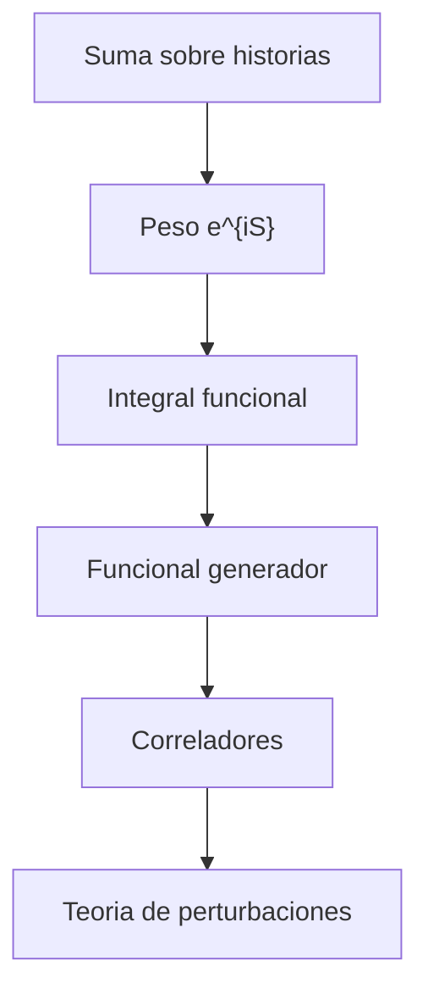

# Modulo 08: Integral de Camino

## Objetivo

Este modulo introduce el formalismo de integral de camino como alternativa y complemento a la cuantizacion canonica.

## Documentos del modulo

1. `01_introduccion_a_la_integral_de_camino.md`
2. `02_funcional_generador_y_correladores.md`

## Mapa del modulo

## Resultado esperado

Al terminar este modulo, deberia poder entenderse:

- por que la amplitud puede verse como suma sobre configuraciones;
- como aparece el peso $e^{iS}$;
- que es un funcional generador;
- como se extraen correladores del formalismo.
