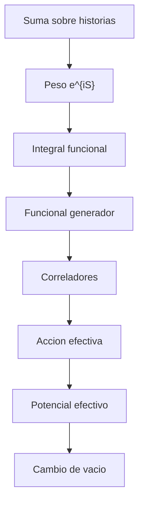

# Modulo 08: Integral de Camino

## Objetivo

Este modulo introduce el formalismo de integral de camino como alternativa y complemento a la cuantizacion canonica.

## Prerequisitos

- [04 Cuantizacion del Campo Escalar](../04_cuantizacion_del_campo_escalar/README.md).
- [05 Interacciones y Perturbaciones](../05_interacciones_y_perturbaciones/README.md).
- Comodidad con accion clasica y amplitudes cuanticas.

## Documentos del modulo

1. `01_introduccion_a_la_integral_de_camino.md`
2. `02_funcional_generador_y_correladores.md`
3. `03_accion_efectiva_y_potencial_efectivo.md`
4. `04_bogoliubov_y_cambio_de_vacio.md`

## Mapa del modulo

## Cuadernos asociados

- `../../Cuadernos/problemas_resueltos/08_accion_y_noether.ipynb`
- `../../Cuadernos/problemas_resueltos/09_cuantizacion_del_campo_escalar.ipynb`
- `../../Cuadernos/ejemplos/11_integral_de_camino_y_accion_efectiva.ipynb`
- `../../Cuadernos/ejemplos/08_entrelazamiento_y_horizontes.ipynb`

Uso sugerido:

- el cuaderno de `08_accion_y_noether` sirve para reforzar el papel estructural de la accion;
- el de `09_cuantizacion_del_campo_escalar` sirve para revisar el campo libre sobre el que se construye el formalismo funcional;
- el de `11_integral_de_camino_y_accion_efectiva` sirve para fijar la cadena conceptual entre $Z[J]$, accion efectiva y potencial efectivo;
- el de `08_entrelazamiento_y_horizontes` sirve como puente hacia cambio de vacio, observador y modulo `11`.

## Resultado esperado

Al terminar este modulo, deberia poder entenderse:

- por que la amplitud puede verse como suma sobre configuraciones;
- como aparece el peso $e^{iS}$;
- que es un funcional generador;
- como se extraen correladores del formalismo;
- que papel cumplen la accion efectiva y el potencial efectivo;
- por que la nocion de vacio puede depender de la descomposicion modal y del observador.

## Ejercicios sugeridos

1. Explica por que el peso $e^{iS}$ organiza la suma sobre historias.
2. Describe la diferencia conceptual entre formalismo canonico y formalismo funcional.
3. Explica que papel cumplen $Z[J]$ y los correladores en la teoria perturbativa.
4. Resume por que la accion efectiva y el potencial efectivo son utiles para estudiar vacios.
5. Explica por que las transformaciones de Bogoliubov preparan el puente hacia el modulo `11`.

## Ampliaciones prioritarias

- añadir un ejemplo mas detallado de potencial efectivo en una teoria escalar;
- profundizar transformaciones de Bogoliubov con un caso simple;
- conectar mas explicitamente con ruptura espontanea de simetria y con el modulo `11`.

## Lecturas y referencias recomendadas

- Introductorio: Zee, capitulos iniciales de integral de camino.
- Intermedio: Srednicki, formalismo funcional desde el comienzo.
- Consulta: Peskin y Schroeder, funcional generador y correladores.

## Navegacion

Anterior: [07 Gauge y QED](../07_gauge_y_qed/README.md)

Siguiente: [09 Renormalizacion](../09_renormalizacion/README.md)
