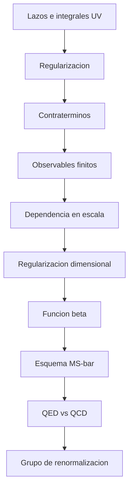

# Modulo 09: Renormalizacion

## Objetivo

Este modulo desarrolla regularizacion, contraterminos, escala de renormalizacion y grupo de renormalizacion.

## Prerequisitos

- [05 Interacciones y Perturbaciones](../05_interacciones_y_perturbaciones/README.md).
- [08 Integral de Camino](../08_integral_de_camino/README.md).
- Familiaridad con integrales de lazo y funcional generador.

## Documentos del modulo

1. `01_origen_de_las_divergencias_y_regularizacion.md`
2. `02_renormalizacion_y_grupo_de_renormalizacion.md`
3. `03_regularizacion_dimensional_en_phi4.md`
4. `04_funcion_beta_y_running_couplings.md`
5. `05_esquema_msbar_y_qed_vs_qcd.md`

## Mapa del modulo

## Cuadernos asociados

- `../../Cuadernos/problemas_resueltos/10_interacciones_y_perturbaciones.ipynb`
- `../../Cuadernos/problemas_resueltos/09_cuantizacion_del_campo_escalar.ipynb`
- `../../Cuadernos/ejemplos/17_esquema_msbar_y_qed_vs_qcd.ipynb`
- `../../Cuadernos/problemas_resueltos/15_regularizacion_dimensional_y_running.ipynb`

Uso sugerido:

- el cuaderno de `10_interacciones_y_perturbaciones` sirve como apoyo para recordar de donde salen los lazos y las correcciones perturbativas;
- el cuaderno de `09_cuantizacion_del_campo_escalar` sirve para revisar la teoria libre sobre la que luego se construyen los contraterminos y correcciones;
- el de `17_esquema_msbar_y_qed_vs_qcd` sirve para fijar la intuicion cualitativa del esquema $\\overline{\\mathrm{MS}}$ y la diferencia entre QED y QCD;
- el de `15_regularizacion_dimensional_y_running` sirve para fijar la intuicion de polos en $1/\\varepsilon$, escala $\\mu$ y running.

## Resultado esperado

Al terminar este modulo, deberia ser posible entender:

- por que aparecen divergencias ultravioletas;
- que significa regularizar una teoria;
- que hace realmente la renormalizacion;
- por que los acoplamientos corren con la escala;
- como leer un polo en $1/\varepsilon$ dentro de regularizacion dimensional;
- que informacion fisica resume una funcion beta.

## Ejercicios sugeridos

1. Explica por que la aparicion de lazos suele ir acompañada de divergencias ultravioletas.
2. Distingue con claridad entre regularizar y renormalizar.
3. Interpreta el papel de la escala $\mu$ en regularizacion dimensional.
4. Explica que resume una funcion beta y por que se relaciona con running couplings.
5. Compara de manera cualitativa que clase de diferencias fisicas puede mostrar el running en QED y en QCD.

## Ampliaciones prioritarias

- añadir un calculo mas detallado de un diagrama a un lazo completo;
- profundizar la relacion entre esquema y observables;
- ampliar con un ejemplo cuantitativo comparativo QED/QCD.

## Lecturas y referencias recomendadas

- Introductorio: Tong, notas sobre divergencias y grupo de renormalizacion.
- Intermedio: Peskin y Schroeder, renormalizacion perturbativa.
- Consulta: Zinn-Justin o Weinberg para una perspectiva mas estructural si el lector quiere profundizar.

## Navegacion

Anterior: [08 Integral de Camino](../08_integral_de_camino/README.md)

Siguiente: [10 Modelo Estandar](../10_modelo_estandar/README.md)
