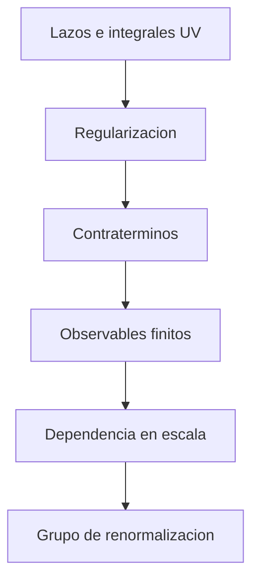

# Modulo 09: Renormalizacion

## Objetivo

Este modulo desarrolla regularizacion, contraterminos, escala de renormalizacion y grupo de renormalizacion.

## Documentos del modulo

1. `01_origen_de_las_divergencias_y_regularizacion.md`
2. `02_renormalizacion_y_grupo_de_renormalizacion.md`

## Mapa del modulo

## Resultado esperado

Al terminar este modulo, deberia ser posible entender:

- por que aparecen divergencias ultravioletas;
- que significa regularizar una teoria;
- que hace realmente la renormalizacion;
- por que los acoplamientos corren con la escala.
