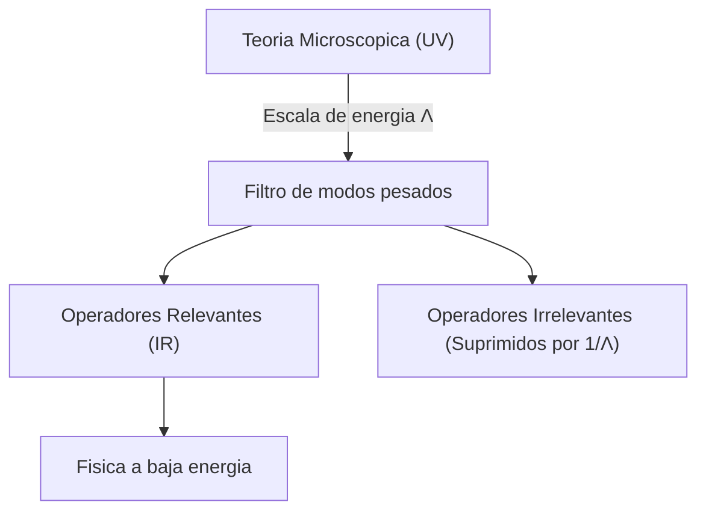

# Modulo 12: Teorias de Campo Efectivas (EFT)

## Objetivo

Este modulo introduce el paradigma moderno de la Teoria Cuantica de Campos: la idea de que toda teoria es una descripcion efectiva valida solo hasta una cierta escala de energia $\Lambda$. 

Aprenderemos como "congelar" o integrar grados de libertad de alta energia para obtener teorias mas simples y potentes a bajas energias.

## Documentos del modulo

1. [Integrando grados de libertad](01_integrando_grados_de_libertad.md)
2. El Lagrangiano de Euler-Heisenberg (Próximamente)
3. Gravedad como Teoría Efectiva (Próximamente)

## Conceptos Clave

### La escala de corte (Cut-off)
En una EFT, no pretendemos que la teoria sea valida hasta energia infinita. Admitimos la existencia de una escala $\Lambda$ donde la fisica cambia (ej: el paso de la teoria de Fermi a la teoria electrodebil).

### Operadores y Dimensionalidad
- **Relevantes**: Aquellos que dominan a baja energia (masas, interacciones basicas).
- **Irrelevantes**: Aquellos suprimidos por potencias de $1/\Lambda^n$. Son la señal de que existe "nueva fisica" mas arriba.

## Por que es importante?
La vision de EFT nos permite:
1. Hacer calculos precisos sin conocer la "Teoria del Todo".
2. Entender por que la QFT es renormalizable (o por que la no-renormalizabilidad no es el fin del mundo).
3. Clasificar las interacciones posibles basandonos solo en simetrias y escalas.
