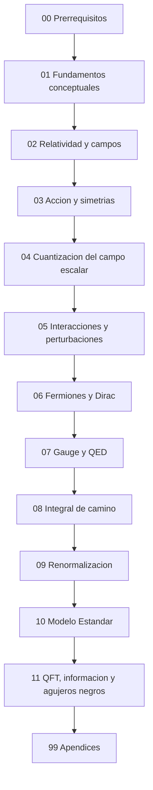
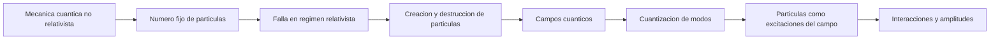
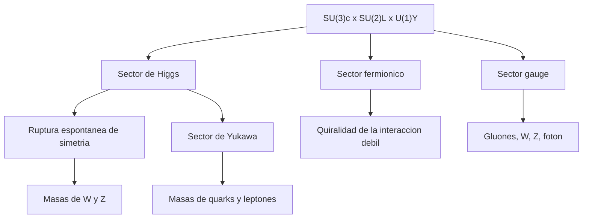

# Tutorial de Teoria Cuantica de Campos

Este directorio contiene el cuerpo principal del tutorial. La estructura ya no se organiza como una lista plana de notas, sino como un recorrido curricular: prerrequisitos, fundamentos conceptuales, modulos tecnicos progresivos, lecturas avanzadas y apendices.

La idea de esta organizacion es simple:

- empezar por intuicion y principios;
- pasar despues a formalismo y cuantizacion;
- llegar mas tarde a interacciones, gauge, renormalizacion y teorias fisicas concretas;
- mantener materiales de apoyo separados del hilo principal.

## Mapa del curso

## Ruta recomendada de lectura

Si estas empezando desde cero, el orden sugerido es:

1. `00_prerrequisitos/README.md`
2. `01_fundamentos_conceptuales/README.md`
3. `02_relatividad_y_campos/README.md`
4. `03_accion_y_simetrias/README.md`
5. `04_cuantizacion_del_campo_escalar/README.md`
6. `05_interacciones_y_perturbaciones/README.md`
7. `10_modelo_estandar/README.md` como lectura avanzada
8. `11_qft_informacion_y_agujeros_negros/README.md` como frontera conceptual avanzada

## Flujo conceptual

## Estructura actual

### `00_prerrequisitos/`

Bloque de entrada para reunir matematicas y fisica necesarias antes del formalismo principal.

### `01_fundamentos_conceptuales/`

- `01_conceptos_fundamentales.md`
- `02_principios_estructurales_de_la_qft.md`
- `03_que_es_un_campo_cuantico.md`

Este bloque fija el lenguaje: que problema resuelve la QFT, que principios la restringen y por que los campos son mas fundamentales que las particulas.

### `02_relatividad_y_campos/`

- `01_choque_entre_mq_y_relatividad.md`
- `02_campos_localidad_y_causalidad.md`

### `03_accion_y_simetrias/`

- `01_principio_de_accion_y_ecuaciones_de_campo.md`
- `02_teorema_de_noether_y_simetria.md`

### `04_cuantizacion_del_campo_escalar/`

- `01_campo_escalar_clasico_y_modos_normales.md`
- `02_cuantizacion_canonica_y_espacio_de_fock.md`

### `05_interacciones_y_perturbaciones/`

- `01_teoria_de_perturbaciones_y_matriz_s.md`
- `02_diagramas_de_feynman_y_reglas.md`

### `10_modelo_estandar/`

- `01_lagrangiano_del_modelo_estandar.md`

Lecturas avanzadas donde el formalismo se conecta con la teoria fisica concreta mas importante de la fisica de particulas no gravitatoria.

### `11_qft_informacion_y_agujeros_negros/`

- `01_qft_informacion_y_entrelazamiento.md`
- `02_agujeros_negros_radiacion_de_hawking_y_paradoja_de_la_informacion.md`

Modulo de frontera donde la QFT se cruza con teoria de la informacion cuantica, horizontes, termicidad efectiva y la paradoja de la informacion de agujeros negros.

### `99_apendices/`

Espacio reservado para convenciones, bibliografia comentada, tablas de notacion y ejercicios resueltos.

## Arquitectura del Modelo Estandar

## Papel de los articulos originales

Los archivos `articulo_01_...` a `articulo_04_...` se mantienen como portadas de navegacion y resumen ejecutivo de los primeros grandes bloques. Ya no deben leerse como tratamiento principal, sino como indice corto hacia los modulos desarrollados.

## Convenciones

- Se usan unidades naturales cuando simplifican la exposicion: $c=\hbar=1$.
- El signo de la metrica debe declararse en cada documento tecnico cuando sea relevante.
- El foco del tutorial es pedagogico, pero las formulas deben escribirse con notacion estandar de QFT.
- Cada modulo deberia incluir contexto, derivaciones minimas, advertencias, preguntas de estudio y ejercicios.

## Siguiente horizonte

Las extensiones mas naturales del tutorial siguen siendo:

- `06_fermiones_y_dirac/`
- `07_gauge_y_qed/`
- `08_integral_de_camino/`
- `09_renormalizacion/`
- ampliacion de `10_modelo_estandar/`
- consolidacion de `11_qft_informacion_y_agujeros_negros/`
