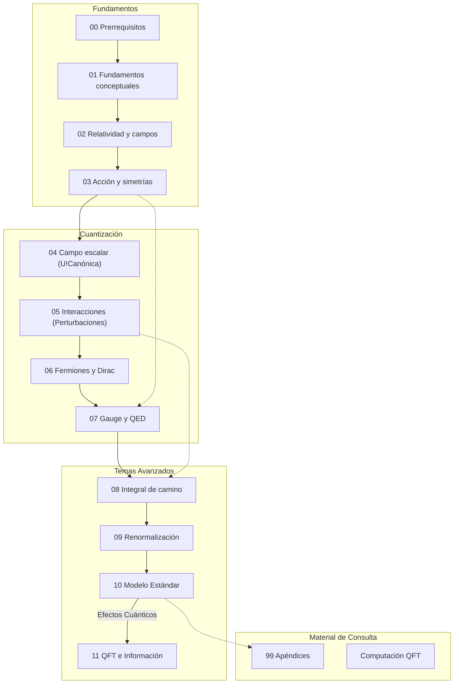
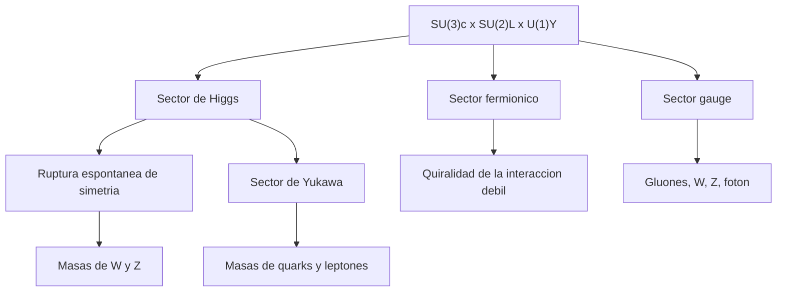

# Tutorial de Teoria Cuantica de Campos

Este directorio contiene el cuerpo principal del tutorial. La estructura ya no se organiza como una lista plana de notas, sino como un recorrido curricular: prerrequisitos, fundamentos conceptuales, modulos tecnicos progresivos, lecturas avanzadas y apendices.

La idea de esta organizacion es simple:

- empezar por intuicion y principios;
- pasar despues a formalismo y cuantizacion;
- llegar mas tarde a interacciones, gauge, renormalizacion y teorias fisicas concretas;
- mantener materiales de apoyo separados del hilo principal.

## Ruta recomendada de lectura

Para una experiencia de aprendizaje secuencial, sigue este orden:

| Orden | Módulo | Descripción |
| :--- | :--- | :--- |
| 1 | [00 Prerrequisitos](00_prerrequisitos/README.md) | Herramientas matemáticas y física básica |
| 2 | [01 Fundamentos](01_fundamentos_conceptuales/README.md) | ¿Qué es un campo y por qué QFT? |
| 3 | [02 Relatividad y Campos](02_relatividad_y_campos/README.md) | Localidad y causalidad |
| 4 | [03 Acción y Simetrías](03_accion_y_simetrias/README.md) | Noether y lagrangianos de campo |
| 5 | [04 Campo Escalar](04_cuantizacion_del_campo_escalar/README.md) | Cuantización canónica y Fock |
| 6 | [05 Interacciones](05_interacciones_y_perturbaciones/README.md) | Matriz S y diagramas de Feynman |
| 7 | [06 Fermiones y Dirac](06_fermiones_y_dirac/README.md) | Campos fermiónicos, espinores y antipartículas |
| 8 | [07 Gauge y QED](07_gauge_y_qed/README.md) | Simetría local, derivada covariante y QED |
| 9 | [08 Integral de Camino](08_integral_de_camino/README.md) | Suma sobre historias y funcional generador |
| 10 | [09 Renormalización](09_renormalizacion/README.md) | Divergencias UV, contraterminos y grupo de renormalización |
| 11 | [10 Modelo Estándar](10_modelo_estandar/README.md) | Aplicación física real (Avanzado) |
| 12 | [11 Fronteras](11_qft_informacion_y_agujeros_negros/README.md) | Hawking e información (Avanzado) |

---

| [<< Inicio (README Principal)](../README.md) | [Bibliografía >>](99_apendices/bibliografia.md) |
| :--- | :--- |

## Flujo conceptual

## Estructura actual

### `00_prerrequisitos/`

Bloque de entrada para reunir matematicas y fisica necesarias antes del formalismo principal.

### `01_fundamentos_conceptuales/`

- `01_conceptos_fundamentales.md`
- `02_principios_estructurales_de_la_qft.md`
- `03_que_es_un_campo_cuantico.md`

Este bloque fija el lenguaje: que problema resuelve la QFT, que principios la restringen y por que los campos son mas fundamentales que las particulas.

### `02_relatividad_y_campos/`

- `01_choque_entre_mq_y_relatividad.md`
- `02_campos_localidad_y_causalidad.md`

### `03_accion_y_simetrias/`

- `01_principio_de_accion_y_ecuaciones_de_campo.md`
- `02_teorema_de_noether_y_simetria.md`

### `04_cuantizacion_del_campo_escalar/`

- `01_campo_escalar_clasico_y_modos_normales.md`
- `02_cuantizacion_canonica_y_espacio_de_fock.md`
- `03_propagador_causalidad_y_funcion_de_green.md`

### `05_interacciones_y_perturbaciones/`

- `01_teoria_de_perturbaciones_y_matriz_s.md`
- `02_diagramas_de_feynman_y_reglas.md`
- `03_reduccion_lsz_y_correladores_amputados.md`
- `04_reglas_de_feynman_resumen_operativo.md`

### `06_fermiones_y_dirac/`

- `01_motivacion_y_ecuacion_de_dirac.md`
- `02_cuantizacion_de_campos_fermionicos.md`
- `03_algebra_gamma_y_bilineales_de_dirac.md`
- `04_corriente_de_dirac_y_limite_no_relativista.md`
- `05_quiralidad_weyl_y_majorana.md`

Bloque que introduce la ecuacion de Dirac, el algebra gamma, los espinores relativistas y la cuantizacion de campos fermionicos con anticonmutadores.

### `07_gauge_y_qed/`

- `01_simetria_gauge_local_y_derivada_covariante.md`
- `02_qed_y_lagrangiano_fundamental.md`
- `03_fijacion_de_gauge_y_propagador_del_foton.md`
- `04_scattering_basico_en_qed.md`
- `05_polarizaciones_y_sumas_de_espin.md`

Modulo dedicado al salto desde simetrias globales a locales, la aparicion del potencial gauge y la estructura minima de QED.

### `08_integral_de_camino/`

- `01_introduccion_a_la_integral_de_camino.md`
- `02_funcional_generador_y_correladores.md`
- `03_accion_efectiva_y_potencial_efectivo.md`
- `04_bogoliubov_y_cambio_de_vacio.md`

Presenta el formalismo de suma sobre historias como lenguaje alternativo y muy util para correladores, teoria perturbativa y conexiones con simetrias.

### `09_renormalizacion/`

- `01_origen_de_las_divergencias_y_regularizacion.md`
- `02_renormalizacion_y_grupo_de_renormalizacion.md`
- `03_regularizacion_dimensional_en_phi4.md`
- `04_funcion_beta_y_running_couplings.md`
- `05_esquema_msbar_y_qed_vs_qcd.md`

Introduce regularizacion, absorcion de divergencias en parametros fisicos y la idea de dependencia con la escala.

### `10_modelo_estandar/`

- `01_lagrangiano_del_modelo_estandar.md`
- `02_sector_gauge_y_estructura_electrodebil.md`
- `03_sector_fermionico_y_quiralidad.md`
- `04_mecanismo_de_higgs_y_ruptura_espontanea.md`
- `05_yukawas_masas_y_parametros.md`
- `06_corrientes_cargadas_y_neutras.md`

Lecturas avanzadas donde el formalismo se conecta con la teoria fisica concreta mas importante de la fisica de particulas no gravitatoria.

### `11_qft_informacion_y_agujeros_negros/`

- `01_qft_informacion_y_entrelazamiento.md`
- `02_agujeros_negros_radiacion_de_hawking_y_paradoja_de_la_informacion.md`
- `03_efecto_unruh_y_vacio_de_rindler.md`
- `04_curva_de_page_y_unitaridad.md`

Modulo de frontera donde la QFT se cruza con teoria de la informacion cuantica, horizontes, termicidad efectiva y la paradoja de la informacion de agujeros negros.

### `99_apendices/`

Espacio reservado para convenciones, ejercicios resueltos y material de consulta:
- [Bibliografía comentada](99_apendices/bibliografia.md)
- [Herramientas Computacionales (FeynCalc/Python)](99_apendices/computacion_qft.md)
- [Reglas de Feynman y propagadores](99_apendices/reglas_de_feynman_y_propagadores.md)
- [Glosario de notación](99_apendices/glosario_notacion.md)
- [Convenciones globales del tutorial](99_apendices/convenciones_globales.md)
- [Plantilla editorial de capítulo](99_apendices/plantilla_de_capitulo.md)

## Arquitectura del Modelo Estandar

## Papel de las portadas-resumen

Los archivos `portada_01_...` a `portada_04_...` se mantienen como portadas de navegacion y resumen ejecutivo de los primeros grandes bloques. Ya no deben leerse como tratamiento principal, sino como indice corto hacia los modulos desarrollados.

## Convenciones

- Se usan unidades naturales cuando simplifican la exposicion: $c=\hbar=1$.
- El signo de la metrica debe declararse en cada documento tecnico cuando sea relevante.
- El foco del tutorial es pedagogico, pero las formulas deben escribirse con notacion estandar de QFT.
- Cada modulo deberia incluir contexto, derivaciones minimas, advertencias, preguntas de estudio y ejercicios.

## Plantilla editorial sugerida

Cada nuevo capitulo deberia intentar incluir, como minimo:

- objetivo y prerequisitos;
- idea fisica antes del formalismo;
- derivacion minima o argumento central;
- ejemplo de calculo;
- errores comunes o advertencias;
- preguntas de comprobacion;
- referencias y lecturas recomendadas.

La plantilla editable se encuentra en [99_apendices/plantilla_de_capitulo.md](99_apendices/plantilla_de_capitulo.md).

## Siguiente horizonte

Las extensiones mas naturales del tutorial siguen siendo:

- ampliacion de `06_fermiones_y_dirac/` con algebra gamma, bilineales y limite no relativista;
- ampliacion de `07_gauge_y_qed/` con fijacion de gauge, tensor de campo e identidades de Ward;
- ampliacion de `08_integral_de_camino/` con derivacion discreta y puente explicito con cuantizacion canonica;
- ampliacion de `09_renormalizacion/` con ejemplos a un lazo y regularizacion dimensional;
- ampliacion de `10_modelo_estandar/`
- consolidacion de `11_qft_informacion_y_agujeros_negros/`
