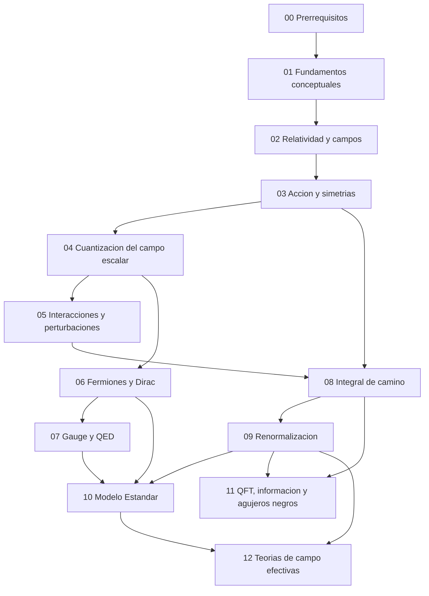

# Mapa de Dependencias Conceptuales

Esta pagina resume como se apoyan unos bloques del tutorial en otros. No representa una dependencia estrictamente formal, sino la mejor lectura pedagógica para que cada tema entre con el menor rozamiento posible.

## Vista global

## Dependencias por modulo

### 00. Prerrequisitos

No depende del resto del tutorial. Fija relatividad, notacion, osciladores, simetrias y Fourier.

### 01. Fundamentos conceptuales

Depende solo del bloque 00 y da sentido al resto del recorrido:

- por que la QFT existe;
- por que los campos son fundamentales;
- que principios la restringen.

### 02. Relatividad y campos

Depende de 00 y 01. Es el puente entre motivacion conceptual y formulacion local en terminos de campos.

### 03. Accion y simetrias

Depende de 02 y prepara casi todo lo tecnico posterior:

- ecuaciones de campo;
- corrientes conservadas;
- lectura estructural de lagrangianos.

### 04. Cuantizacion del campo escalar

Depende fuertemente de 03 y del oscilador armonico del modulo 00. Es la puerta de entrada a Fock, propagadores y particulas como excitaciones.

### 05. Interacciones y perturbaciones

Depende de 04. Si no se domina bien espacio de Fock y propagador libre, Dyson, diagramas y LSZ quedan demasiado formales.

### 06. Fermiones y Dirac

Depende de 02 y 04. Repite la logica de cuantizacion en el caso fermionico y prepara la entrada a quiralidad y teorias gauge.

### 07. Gauge y QED

Depende de 05 y 06:

- de 05 toma la logica de amplitudes y reglas de Feynman;
- de 06 toma corrientes fermionicas y estructura de Dirac.

### 08. Integral de camino

Depende de 03 y 05. Es mas natural cuando ya se entiende accion, correladores y amplitudes en el lenguaje canonico.

### 09. Renormalizacion

Depende de 05 y 08:

- los lazos aparecen en perturbaciones;
- el formalismo funcional ayuda a leer mejor regularizacion, contraterminos y running.

### 10. Modelo Estandar

Depende sobre todo de 06, 07 y 09. Sin quiralidad, gauge y renormalizacion, el modulo se vuelve solo una lista de sectores.

### 11. QFT, informacion y agujeros negros

Depende principalmente de 08 y 09. Tambien se beneficia de una intuicion madura de vacio, correladores y estados reducidos.

### 12. Teorias de campo efectivas

Depende de 09 y 10:

- de 09 toma escalas, running y estructura UV/IR;
- de 10 toma el Modelo Estandar como punto de partida para extensiones efectivas.

## Dependencias conceptuales clave

### Para entender LSZ

Conviene dominar antes:

- [Cuantizacion canonica y espacio de Fock](04_cuantizacion_del_campo_escalar/02_cuantizacion_canonica_y_espacio_de_fock.md)
- [Propagador, causalidad y funcion de Green](04_cuantizacion_del_campo_escalar/03_propagador_causalidad_y_funcion_de_green.md)
- [Diagramas de Feynman y reglas](05_interacciones_y_perturbaciones/02_diagramas_de_feynman_y_reglas.md)

### Para entender QED

Conviene dominar antes:

- [Corriente de Dirac y limite no relativista](06_fermiones_y_dirac/04_corriente_de_dirac_y_limite_no_relativista.md)
- [Quiralidad, espinores de Weyl y fermiones de Majorana](06_fermiones_y_dirac/05_quiralidad_weyl_y_majorana.md)
- [Teoria de perturbaciones y matriz S](05_interacciones_y_perturbaciones/01_teoria_de_perturbaciones_y_matriz_s.md)

### Para entender renormalizacion

Conviene dominar antes:

- [Funcional generador y correladores](08_integral_de_camino/02_funcional_generador_y_correladores.md)
- [Teoria de perturbaciones y matriz S](05_interacciones_y_perturbaciones/01_teoria_de_perturbaciones_y_matriz_s.md)
- [Diagramas de Feynman y reglas](05_interacciones_y_perturbaciones/02_diagramas_de_feynman_y_reglas.md)

### Para entender el Modelo Estandar

Conviene dominar antes:

- [QED y lagrangiano fundamental](07_gauge_y_qed/02_qed_y_lagrangiano_fundamental.md)
- [Quiralidad, espinores de Weyl y fermiones de Majorana](06_fermiones_y_dirac/05_quiralidad_weyl_y_majorana.md)
- [Funcion beta y running couplings](09_renormalizacion/04_funcion_beta_y_running_couplings.md)

### Para entender islas y holografia

Conviene dominar antes:

- [Accion efectiva y potencial efectivo](08_integral_de_camino/03_accion_efectiva_y_potencial_efectivo.md)
- [Curva de Page y unitaridad](11_qft_informacion_y_agujeros_negros/04_curva_de_page_y_unitaridad.md)
- [Efecto Unruh y vacio de Rindler](11_qft_informacion_y_agujeros_negros/03_efecto_unruh_y_vacio_de_rindler.md)

## Como usar este mapa

- Si un capitulo se te hace abrupto, vuelve a esta pagina y revisa sus dependencias cercanas.
- Si quieres estudiar por tema, combina esta pagina con [Rutas de lectura](rutas_de_lectura.md).
- Si quieres afinar prerequisitos a nivel de capitulo, usa tambien el [Catalogo de capitulos y etiquetas](catalogo_de_capitulos_y_etiquetas.md).

---

[Volver al indice del tutorial](README.md)
