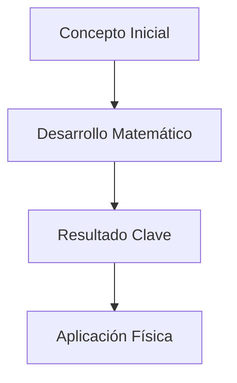

# Módulo [Número]: [Nombre del Módulo]

## Objetivo

[Breve descripción del propósito pedagógico del módulo y qué problemas de la QFT resuelve.]

## Documentos del módulo

1. `01_[Nombre_Documento].md`
2. `02_[Nombre_Documento].md`

## Mapa del módulo

## Ecuaciones Centrales

1. **[Nombre de Ecuación]**:
   $$ [Ecuación LaTeX] $$

2. **[Nombre de Ecuación]**:
   $$ [Ecuación LaTeX] $$

## Resultado esperado

Al finalizar este módulo, el estudiante debería:
- [Punto clave 1]
- [Punto clave 2]
- [Punto clave 3]

## Preguntas de estudio

- [Pregunta conceptual 1]
- [Pregunta conceptual 2]

## Ejercicios sugeridos

1. [Ejercicio de derivación]
2. [Ejercicio de aplicación o cálculo]

---
| [<< Anterior](../[Modulo_Anterior]/README.md) | [Índice](../README.md) | [Siguiente >>](../[Modulo_Siguiente]/README.md) |
